# 【Debugx 用户手册】
## 【简介】
Github：https://github.com/BlurFeng/Debugx

这是一个Unity引擎的插件。\
用于按调试成员管理DebugLog，并输出log文件到本地。使用宏"DEBUG_X"来开启功能。

在多人开发项目时，所有人都使用UnityEngine.Debug.Log()会导致Log难以管理和区分。\
我们在测试自己的功能时，并不想被其他人的Log影响。\
我们仅需要将"DEBUG_X"宏添加到我们的项目，并简单地进行配置，就可以开始使用Debugx的功能了。\
Debugx在ProjectSettings和Preferences中分别提供了配置界面，在ProjectSettings中的配置会影响整个项目，而Preferences中的用户配置仅会影响你本地个人，不会对项目和其他人造成影响。\
DebugxConsole用于在项目运行时操作打印开关等内容。

## 【添加插件到项目并配置】
跟随手册，快速安装Debugx插件并配置。

### 【添加插件到你的项目】
下载Releases包，使用.unitypackage包安装Debugx插件到你的项目。
或者直接下载Github项目中的Debugx文件夹并放入你的项目中。
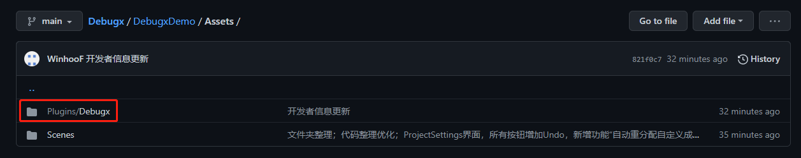

### 【添加宏到你的项目】
我们必须在项目中添加宏DEBUG_X才能开启打印功能。
在项目打包时，我们可以去除宏DEBUG_X来快速的关闭Debugx的功能。
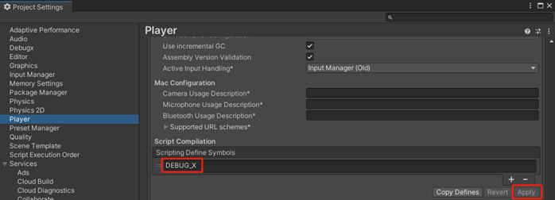

### 【Debugx配置】
鼠标悬停在字段上，会出现tooltip提示，这会更好的帮助你上手Debugx。\
所以我不会对每个条目进行介绍，因为你可以自己查看tooltip。
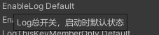

#### 【ProjectSettings 项目设置】
在Editor>ProjectSettings>Debugx中打开Debugx项目设置界面。\
项目设置会对整个项目都产生影响。当我们想要添加新的成员时，就是在这里添加的。
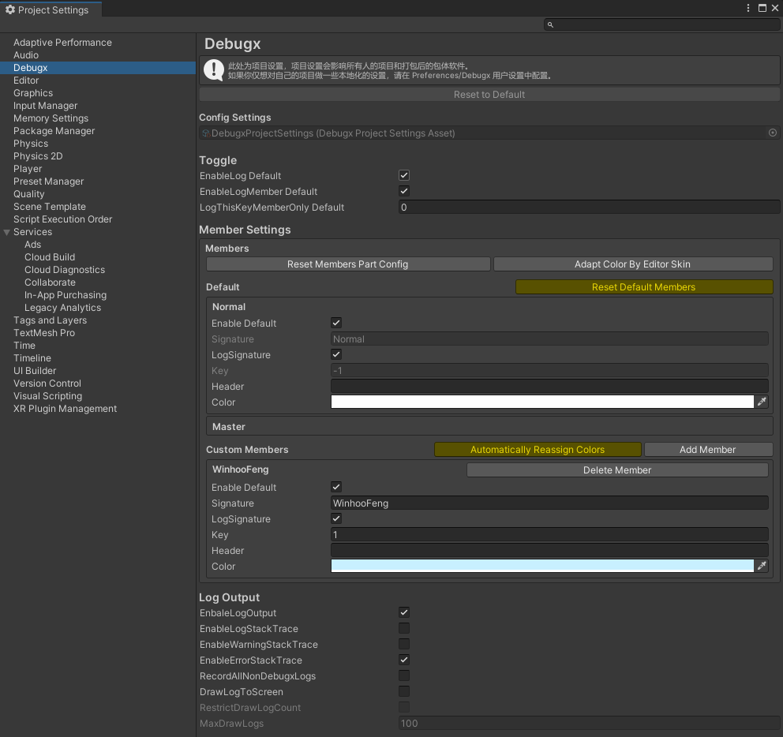

##### 【Toggle 开关】
这里是一些开关设置。总控开关会在这显示，而调试成员可以在成员信息中单独设置开关。
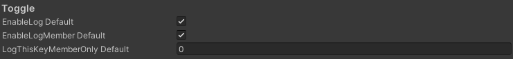

##### 【MemberSettings 调试成员设置】
成员设置用于配置调试成员。这里有一些默认的成员，他们不能被删除，仅能进行有限的编辑。\
我们可以在自定义成员中添加你的专用成员配置，按项目的使用者去区分。\
我们可以设置开关，签名，颜色等内容。最重要的是成员的Key，这在我们打印时会用到。一个成员只需要记住自己的Key就行了。\
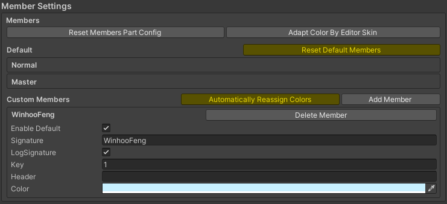

##### 【LogOutput】
日志输出功能会在每次项目开始运行时开始记录，在项目停止运行时结束记录并输出到本地。\
在编辑器时，log本地文件会输出到你项目根目录的Logs文件夹下。\
在打包时，根据不同的平台，log本地文件会存储到不同的目录中。\
PC平台一般在C:\Users\UserName\AppData\LocalLow\DefaultCompany\ProjectName目录下。
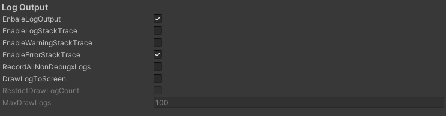

#### 【Preferences用户偏好设置】
在Editor>Preferences>Debugx中打开Debugx用户偏好设置界面。\
用户偏好设置仅会对你个人本地的项目产生影响，并不会影响其他人的项目。也不会对打包产生作用。\
主要是为了不同的开发者在自己本地，按个人需求进行配置。每个人在自己的项目上，一般只会打开自己的调试成员的开关。因为我们不想被其他人的调试打印影响。
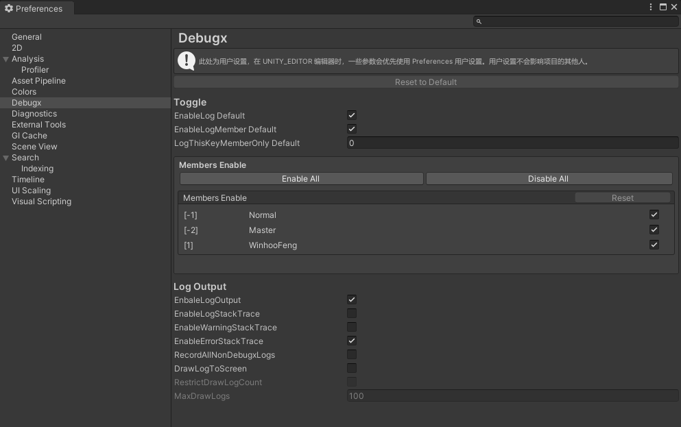

## 【在代码中使用Log打印】
现在，我们可以开始打印我们的Log了。直接调用Debugx类的静态方法来打印我们的Log。
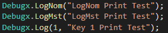

### 【打印方法】
**Debugx.Log(key, message)**\
Log系列方法是我们最常使用的方法，我们需要传入Key和打印内容。Key是我们在调试成员配置中配置的成员所分配的Key。每个成员需要记住和使用自己的Key。\
**Debugx.LogNom(message)**\
LogNom系列方法是Normal普通成员使用的Log打印方法。一般成员不应当使用，否则容易混淆使用者。也可以让所有成员在打印通用的报错或者警告时使用LogNom，保证一些关键信息总是保持打印。\
**Debugx.LogMst(message)**\
LogMst系列方法是Master高级成员使用的Log打印方法。除了主程，一般人都不应该直接使用此系列方法。\
**Debugx.LogAdm(message)**\
LogAdm系列方法是由Debugx插件的开发者使用的！任何人都不应当使用此方法，因为此方法打印的Log并不能通过DebugxManager来进行开关。但他还是受到宏DEBUG_X的影响。

## 【DebugxConsole】
debugx控制台主要用于在项目运行时对Debugx功能进行一些开关操作。在Window>Debugx>DebugxConsole中打开窗口。/
为了方便，我们可以将它和Game页签放在一起。
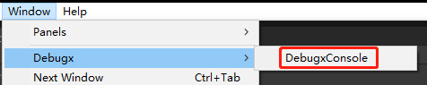

### 【PlayingSettings】
项目运行时设置的内容基本上和ProjectSetting中的一样，只是这是允许在运行时设置的。
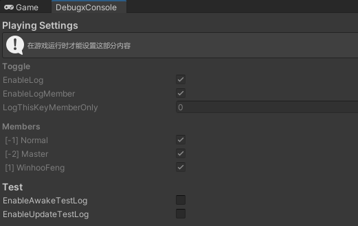
#### 【Test】
测试用功能。提供了一些方便的测试用功能开关，用来确认Debugx功能是否正常的运作了。

## 【DebugxManager】
DebugxManager在游戏运行时自动创建，我们一般不用去管他。他的主要工作是对LogOutput进行操作。\
只有在DEBUG_X宏添加到项目时，DebugxManager才会自动创建。

## 【DebugxBurst】
DebugxBurst类主要用于DOTS的Burst多线程中进行Log打印。其中的Log方法基本和Debux中的一致，最终会调用到Debugx中的打印方法。必须在Entities.ForEach().WithoutBurst().Run()时才能打印，否则Log会被排除。\
DebugxBurst的Log方法都添加了[BurstDiscard]标记，用于在Burst多线程时被排除。直接使用Debugx的Log方法会导致编译报错。因为[BurstDiscard]特性，Debugx源码中的字典，列表和数组都不会导致Burst的报错。

### 【LogInBurst】
我们还提供了LogInBurst系列方法允许在Entities.ForEach().Schedule()时使用，但是此方法不支持任何调试成员信息。我们只能打印简单的string。

### 【Burst中的限制】
关于一些受到限制的代码和功能。这会在编译时会直接报红。\
在DOTS的Burst多线程中，不能使用任何引用类型，string只能直接传递，使用String.Format时不能传入string类型。\
UnityEngine.Debug.unityLogger()不能使用。只能直接使用UnityEngine.Debug.Log等方法，这类方法应该是由引擎开封这做过特殊处理，从而能够直接传参object类型。\
使用外部的值时，值必须是只读的。\
in ref out 都不支持。\
所以使用[BurstDiscard]特性用于在多线程时直接排除此方法，添加此宏能够使一些被限制的代码在编译时不报错，但必须在Entities.ForEach().WithoutBurst().Run()才能工作;,因为所有[BurstDiscard]特性的方法在多线程中都不工作。\
使用LogInBurst()方法可以直接在Burst多线程中打印（但不支持任何成员配置信息），效果和UnityEngine.Debug.Log()是一样的，这种方法应该经过处理，所以直接传参object也不会报错。