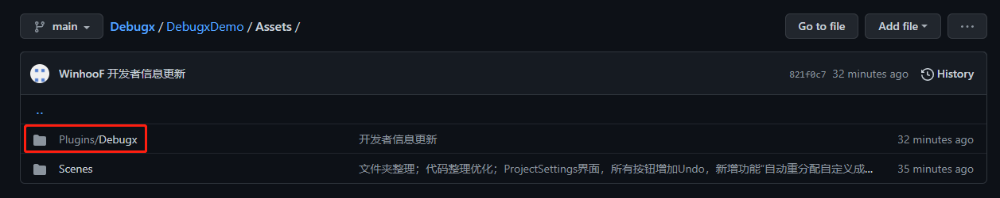
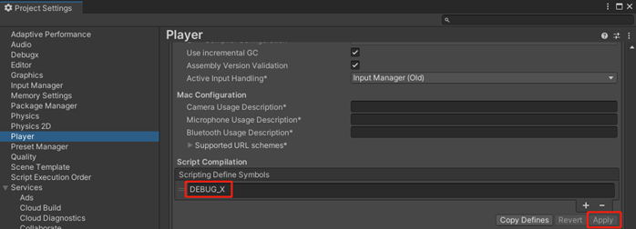
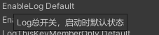
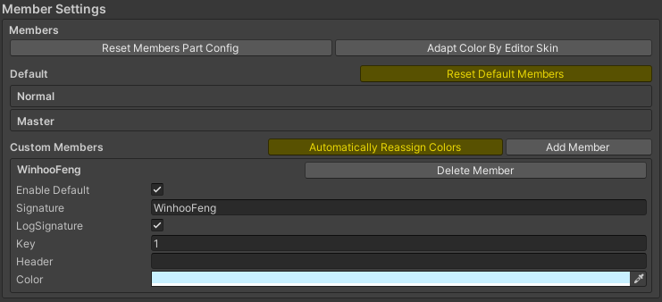
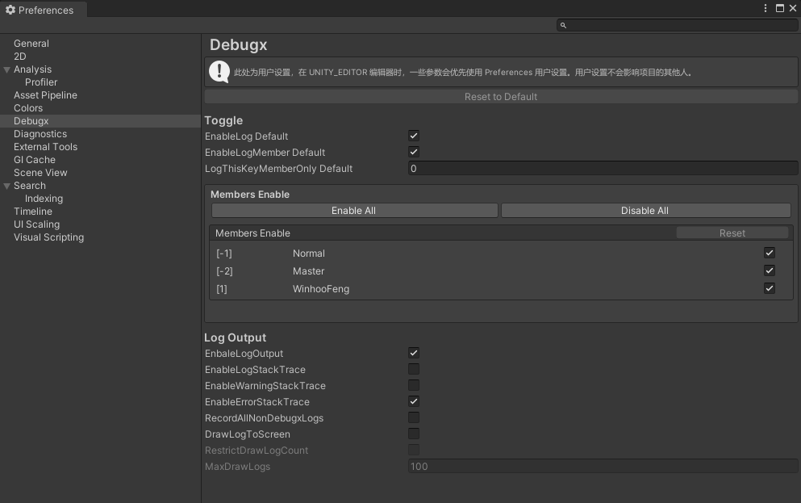

# 【Debugx User Manual】
## 【About】
Github：https://github.com/BlurFeng/Debugx

This is a plugin for Unity engine.\
Used to manage the DebugLog by debug member and output log files to the local. Use the macro "DEBUG_X" to enable functionality.

When developing a project with multiple people, everyone using UnityEngine.Debug.Log() can make logs difficult to manage and differentiate.\
We don't want to be affected by other people's logs when testing our own features. \
We just need to add the "DEBUG_X" macro to our project and simply configure it to start using the Debugx functionality. \
The Debugx provides configuration interfaces in ProjectSettings and Preferences. The configuration in ProjectSettings affects the entire project. The user configuration in Preferences affects only your local individual, and does not affect the project or other people.\
The DebugxConsole is used to operate things like print switches while the project is running.

## 【Add plug-ins to the project and configure】
Follow the manual to quickly install and configure the Debugx plug-in.

### 【Add plugins to your project】
Download the Releases package and install the Debugx plugin into your releases using the.Unitypackage package.\
Or just download the Debugx folder in the Github project and put it into your project.

### 【Add macros to your project】
We must add the macro DEBUG_X to the project to enable printing.\
When the project is packaged, we can remove the macro DEBUG_X to quickly close the Debugx function.

### 【Debugx settings】
Hovering over a field will bring up a tooltip prompt, which will help you better get started with the Debugx. \
So I won't go into every entry, because you can check out the tooltip yourself.

#### 【ProjectSettings】
Open the Debugx ProjectSettings screen in Editor>ProjectSettings>Debugx. \
Project Settings have an impact on the entire project. When we want to add new members, this is where we add them.

##### 【Toggle】
Here are some switch Settings. The master control switch is displayed here, and the debug member can set the switch separately in the member information.

##### 【MemberSettings】
Member Settings are used to configure debug members. There are some default members that cannot be removed and only limited edits can be made. \
We can add your private member configuration to the custom members, differentiated by the user of the project. \
We can set switches, signatures, colors, etc. The most important thing is the member Key, which will be used when we print. A member only needs to remember his own Key. \

##### 【LogOutput】
The log output function starts recording each time the project starts running and ends recording and output to the local when the project stops running. \
In the editor, the log local file is output to the Logs folder in the root directory of your project. \
When packaging, log local files are stored in different directories depending on the platform. \
The PC platform is generally in the C:\Users\UserName\AppData\LocalLow\DefaultCompany\ProjectName directory.

#### 【Preferences】
Open the Debugx user Preferences screen in Editor>Preferences>Debugx. \
User preferences only affect your own local project, not anyone else's. It won't have any effect on packing. \
Mainly for different developers in their own local, according to the individual needs of the configuration. Each person on their own project will generally only turn on their own debug member switch. Because we don't want to be affected by someone else's debug print.

## 【Print using Log in your code】
Now, we can start printing our Log. Call the static method of the Debugx class directly to print our Log.

### 【Printing method】
**Debugx.Log(key, message)**\
The Log family of methods is the one we use most often, and we need to pass in the Key and print the content. The Key is the Key assigned to the member that we configured in the debug member configuration. Each member needs to remember and use their own Key. \
**Debugx.LogNom(message)**\
The LogNom family methods are the Log printing methods used by the Normal members. General members should not use, otherwise easy to confuse the user. You can also have all members use LogNom when printing generic errors or warnings, ensuring that some key information always remains printed. \
**Debugx.LogMst(message)**\
The LogMst family method is the Log printing method used by the Master senior members. This family of methods should not be used directly by anyone other than the main routine. \
**Debugx.LogAdm(message)**\
The LogAdm family of methods is used by the developer of the Debugx plugin! This method should not be used by anyone, because the Log printed by this method cannot be switched on or off through the DebugxManager. But he is still affected by the macro DEBUG_X.

## 【DebugxConsole】
The debugx console is mainly used to switch on and off the Debugx function when the project is running. Open the Window in Window>Debugx>DebugxConsole. /
For convenience, we can put it together with the Game TAB.

### 【PlayingSettings】
The project runtime Settings are basically the same as in ProjectSetting, except that this is allowed at runtime.

#### 【Test】
Test function. Provides some convenient test function switches, used to confirm that the Debugx function is running properly.

## 【DebugxManager】
The DebugxManager is created automatically when the game is running, and we usually don't have to worry about it. His main job is to operate the LogOutput. \
The DebugxManager is created automatically only when the DEBUG_X macro is added to the project.

## 【DebugxBurst】
The DebugxBurst class is mainly used for Log printing in Burst multithreading in DOTS. The Log method is basically the same as that in the Debux, and will eventually call the print method in the Debugx. Print only when Entities.ForEach().withoutburst ().run (), otherwise Log will be excluded. \
The Log methods of DebugxBurst are all tagged with [BurstDiscard] to be excluded from Burst multithreading. Using the Debugx Log method directly will result in a compilation error. Because of the [BurstDiscard] feature, dictionaries, lists, and arrays in Debugx source code do not cause Burst errors.

### 【LogInBurst】
We also provide the LogInBurst family of methods to be used with Entities.ForEach().schedule (), but this method does not support any debugging member information. We can only print simple strings.

### 【Restrictions in Burst】
About some limited code and functionality. This will go straight to red when compiled. \
In DOTS 'Burst multithreading, you can't use any reference type, string can only be passed directly, and you can't pass a String type when using string.format. \
UnityEngine. Debug. UnityLogger () cannot be used. You can only directly use methods such as UnityEngine.Debug.Log, which should be specially handled by the engine to pass the object type directly. \
When using an external value, the value must be read-only. \
Neither is supported in ref out. \
So using the [BurstDiscard] feature to exclude this method directly when multithreading, adding this macro can make some restricted code compile without error, but must work at Entities.ForEach().WithoutBurst().Run(); Because all [BurstDiscard] methods do not work in multithreading. \
The LogInBurst() method can be used to print directly in the Burst multithread (but does not support any member configuration information), the effect is the same as UnityEngine.Debug.Log(), this method should be processed, so directly passing object will not report errors.