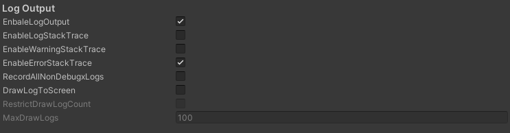
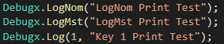
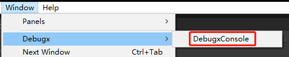

# 【Debugx ユーザーマニュアル】
## 【概要】
Github：https://github.com/BlurFeng/Debugx

こちらはUnity用プラグインです。\
メンバーによってデバッグログを管理し、ローカルにログファイルを出力することができます。\
マクロ「DEBUG_X」で機能をオンにします。

複数人でプロジェクトを開発する場合、誰もがUnityEngine.Debug.Log()を使用すると、Logの管理と区別が困難になります。\
私たちは自分の機能をテストしていますが、他人のログに影響されたくありません。\
プロジェクトに「DEBUG_X」マクロを追加し、簡単な設定をするだけで、Debugxの機能を使い始めることができます。\
DebugxはProjectSettingsとPreferencesの設定インターフェースをそれぞれ提供しており。Projectsettings の設定はプロジェクト全体に影響します。Preferencesの設定はあなただけに影響し、プロジェクトや他の人には影響しません。\
DebugxConsoleは、プロジェクトの実行時に印刷スイッチなどを操作するためのコンソールです。

## 【プロジェクトへのプラグインの追加と設定】
マニュアルに従って、Debugxプラグインを素早くインストールして設定します。

### 【プロジェクトにプラグインを追加する】
Releasesパッケージをダウンロードし、.unitypackageパッケージを使って、プロジェクトにDebugxプラグインをインストールします。または、Githubプロジェクト内のDebugxフォルダを直接ダウンロードして、プロジェクトに入れてください。

### 【プロジェクトにマクロを追加する】
印刷機能を有効にするには、プロジェクトにマクロ「DEBUG_X」を追加する必要があります。
プロジェクトをリリースしたとき、マクロ「DEBUG_X」を削除することで、Debugxの機能をオフにすることができます。

### 【Debugx配置】
アイテムにカーソルを合わせるとtooltip説明が表示されるので、 Debugxを使い始めるときに便利です。\
だから、それぞれの項目については紹介しません。tooltipで機能を了解してください。

#### 【ProjectSettings プロジェクト設置】
Editor>ProjectSettings>DebugxでDebugxのProjectSettingsの設定画面を開くことができます。\
プロジェクト設定は、プロジェクト全体に影響します。\
新しいメンバーを追加したい場合は、ここで追加します。

##### 【Toggle スイッチ】
ここでは、いくつかのスイッチがあります。\
デバッグメンバーは、メンバー情報で個別にスイッチを設定できます。

##### 【MemberSettings デバッグメンバー設置】
メンバー設定は、デバッグメンバーを構成するために使用されます。\
デフォルトのメンバーは削除することはできませんが、限られた設定を行うことができます。\
カスタムメンバーにメンバーを追加することができます。プロジェクトのユーザーによって区別する。\
私たちは、スイッチ、署名、色などを設定することができます。最も重要なのは、印刷するときに使用するメンバーのキーです。メンバーは自分のキーを覚えるだけでいいです。\

##### 【LogOutput】
ログ出力機能は、プロジェクトが実行を始めるたびに記録を開始し、プロジェクトが実行を停止するたびに記録を終了し、ローカルに出力します。\
エディターの場合は、ログファイルは、プロジェクトのルートにあるlogsフォルダに出力されます。\
リリースの場合は、ログファイルはプラットフォームによって異なるディレクトリに保存されます。\
PCの場合はC:\Users\UserName\AppData\LocalLow\DefaultCompany\ProjectNameです。

#### 【Preferences設置】
Editor>Preferences>DebugxでDebugxのPreferencesの設定画面を開くことができます。\
こちらは個人的なローカルのプロジェクトにのみ影響を与え、他の人のプロジェクトには影響を与えません。リリースにも効果がありません。\
これは、さまざまな開発者がローカルで個々のニーズに合わせて設定できるようにするためです\
通常、デバッグメンバー自分のスイッチのみをオンにします。他の人のデバッグプリントによって影響を受けたくないからです。

## 【コードにLogを使用する】
これで、ログの印刷を開始できます。Debugxクラスの静的メソッドを直接使ってLogを出力します。

### 【プリントメソッド】
**Debugx.Log(key, message)**\
Logファミリメソッドは最も一般的に使用されるメソッドであり、キーとコンテンツを入力して印刷することができます。Keyは、デバッグメンバー設置で設定したメンバーによって割り当てられたKeyです。各メンバーは自分のキーを覚えて使用します。\
**Debugx.LogNom(message)**\
LogNomファミリのメソッドは、通常のメンバーが使用するLog印刷方法です。普段は使いませんが、通用のエラーメッセージや警告メッセージを印刷するときに使うと，重要な情報がいつも印刷されていることができます。\
**Debugx.LogMst(message)**\
LogMstファミリメソッドはリーダーが使用するLogです。マネージャーを除いて、一般の人々はこのメソッドを使用すべきではありません。\
**Debugx.LogAdm(message)**\
LogAdmシリーズのメソッドは、Debugxプラグインの開発者によって使用されています!誰もこの方法を使うべきではありません。このメソッドによって出力されたログは、DebugxManagerによって切り替えることができません。しかし、マクロ「DEBUG_X」の影響を受けています。

## 【DebugxConsole】
debugxコンソールは、主にプロジェクトの実行時にDebugx機能のスイッチ操作を行うために使用されます。Window>Debugx>DebugxConsoleでウィンドウを開きます。/

### 【PlayingSettings】
プロジェクトの実行時設定は、基本的にはDebugxのプロジェクト設定と同じですが、実行時に設定できます。

#### 【Test】
テスト用機能。Debugx機能が正常に動作しているかどうかを確認するための、便利なテスト用ファンクションスイッチが用意されています。

## 【DebugxManager】
DebugxManagerはゲームの実行時に自動的に作成されます。彼の主な仕事はLogOutputの操作である。\
DebugxManagerは、マクロ「DEBUG_X」がプロジェクトに追加されたときにのみ自動的に作成されます。

## 【DebugxBurst】
DebugxBurst クラスは、主にDOTSのBurstのマルチスレッドでLogを行うために使われています。ここでLogメソッドは基本的にはデバックスと一致しており、最終的にはデバッグ内の印刷メソッドに呼び出されます。\
Entities.ForEach().WithoutBurst().Run()にのみ使います。\
DebugxBurstのLogメソッドには、Burstがマルチスレッドである場合に除外するために使用される[BurstDiscard]フラグが追加されています。DebugxのLogメソッドを直接使用すると、コンパイルエラーが発生します。Debugxソースコード内のディクショナリ、リスト、および配列のいずれも、[BurstDiscard]特性のためにBurstのエラーは発生しません。

### 【LogInBurst】
我们还提供了LogInBurst系列方法允许在Entities.ForEach().Schedule()时使用。但是此方法不支持任何调试成员信息。我们只能打印简单的string。
Loginburst ファミリのメソッドも用意されており、Entities.ForEach().Schedule()の場合に使用することができます。しかし、このメソッドはデバッグメンバー情報をサポートしていません。単純なStringを印刷するだけです。