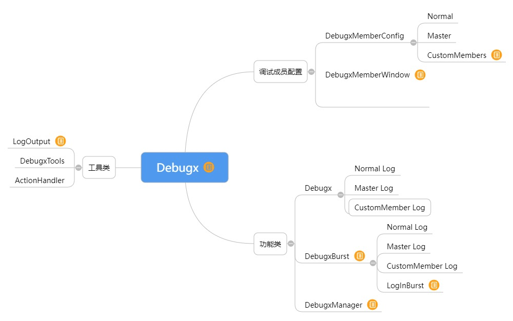
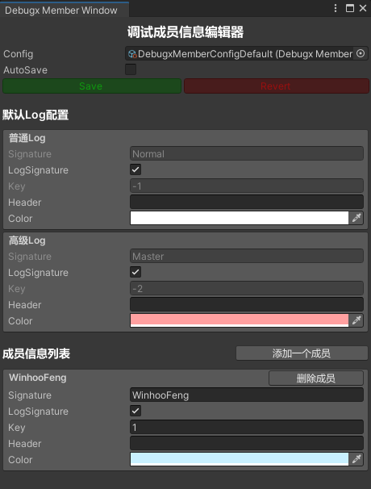
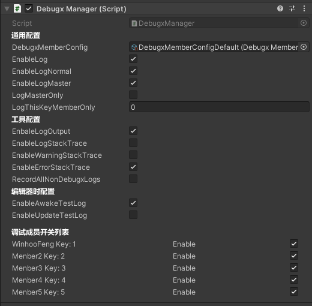
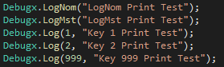
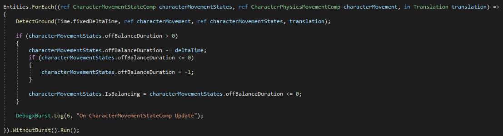

# Debugx
This is a plugin for Unity engine. 
The debug log is managed according to its members.use macro "DEBUG_X" open the functional. 
这是一个Unity引擎的插件。 
此插件用于以成员的方式管理调试日志。使用宏"DEBUG_X"来开启功能。 

Configure debug members through the edit window. 
通过编辑窗口来配置调试成员。 

Add the debug manager to the project scenario and set the switch through the inspector.  
You can also set the switch dynamically in code. 
添加调试管理器到项目场景，并通过检视面板设置开关。你也可以在代码中动态的设置开关。 

In your code, use debugx.log () to print like this. 
在你的代码中，像这样去使用Debugx.Log()来进行打印。 

This is the Log used in the Burst of UnityDOTS.  
We must use DebugxBurst instead of Debugx because many methods and fields will not be available in Burst. 
这是在UnityDOTS的Burst中使用的Log。我们必须使用DebugxBurst而不是Debugx，因为很多方法和字段在Burst中将不可用。 
