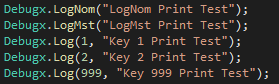
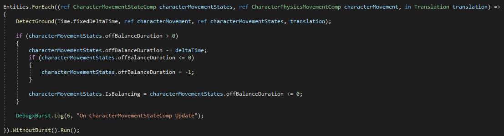

# 【Debugx】
***阅读中文文档 >[中文](README.md)***\
***日本語のドキュメントを読む >[日本語](README_ja.md)***\
***Read this document in >[English](README_en.md)***

## 【User Manual】
**阅读中文用户手册 >[中文用户手册](Documents/UserManual_cn.md)**\
**日本語のユーザーマニュアルを読む >[日本語ユーザーマニュアル](Documents/UserManual_ja.md)**\
**Read this User Manual in >[English User Manual](Documents/UserManual_en.md)**

## 【UPM】
Allows the plugin to be loaded into a Unity project via the Package Manager.\
Open the Unity menu and go to Window > Package Manager.\
Click the + button in the top-left corner of the window, then select Add package from git URL...\
Paste the following URL to install the plugin as a package:\
https://github.com/BlurFeng/Debugx.git?path=DebugxDemo/Assets/Plugins/Debugx

## 【Overview】
This is a plugin for Unity engine.\
The debug log is managed according to its members. Later export the log file to the local. use macro "DEBUG_X" open the functional.

In your code, use debugx.log () to print like this.\
Different members use different keys, you can easily print by member, and quickly find the person in charge of the corresponding code.\

In the Burst of UnityDOTS. \
We must use DebugxBurst instead of Debugx because many methods and fields will not be available in Burst.\
However, because UnityDOTS is updated very frequently, this method cannot guarantee complete reliability under different DOTS versions.\
